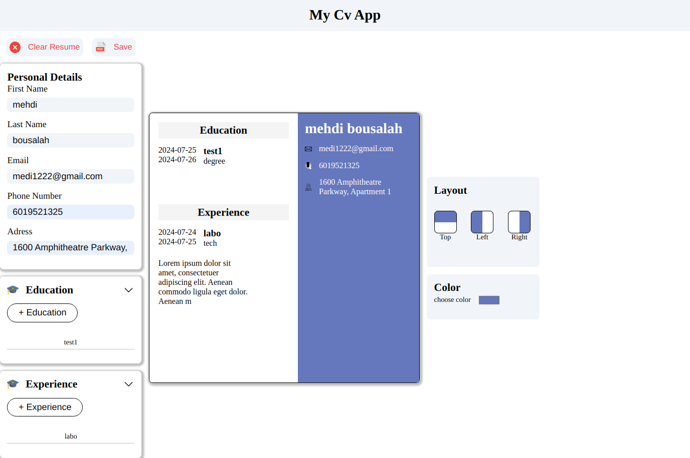
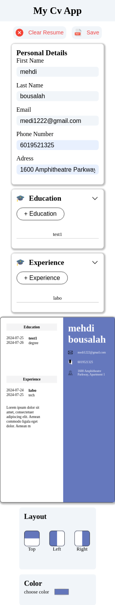

# Frontend Mentor - 3-column preview card component solution

This is a solution to the [Project: CV Application on the Odin Project](https://www.theodinproject.com/lessons/node-path-react-new-cv-application). 

## Table of contents

- [Overview](#overview)
  - [The challenge](#the-challenge)
  - [Screenshot](#screenshot)
  - [Links](#links)
- [My process](#my-process)
  - [Built with](#built-with)
- [Author](#author)

## Overview

### The challenge

Users should be able to:

- Create and customize their CV using an intuitive interface
- See real-time previews of their CV as they make changes
- Access and use various templates and design options
- Save, export, and print their CV 

### Screenshot

  ## Desktop 
  

  ## Mobile 
  

### Links

- Solution URL: [solution](https://github.com/Medido1/The-OdinProject-CV-Application)
- Live Site URL: [live site](https://snazzy-cranachan-736652.netlify.app/)

## My process

### Built with

- React
- CSS custom properties
- Flexbox
- Mobile-first workflow

## Author

- Frontend Mentor - [@Medido1](https://www.frontendmentor.io/profile/Medido1)
- GitHub - [@Medido1](https://github.com/Medido1)
